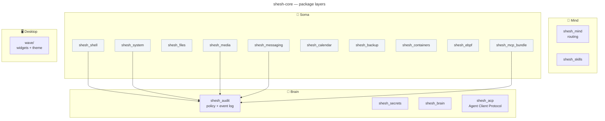

# 🧩 shesh-core

**Shesh Brain/Soma core** — the consolidated home of the 16 small `shesh-*` MCP
servers and tools that used to live in 16 separate repos, plus the Wave terminal
widgets/config.


- **License:** GPL-3.0-or-later
- **Owner:** Gagan Jain ([@gaganjainse](https://github.com/gaganjainse))
- **Layer:** Brain + Soma (16 folded packages) · **Part of:** [shesh-ecosystem](https://github.com/gaganjainse/shesh-ecosystem)


## Why one repo

Consolidation rationale (2026-08-13 fleet audit, ADR-0019): federation is right
for independently versioned services, but a 150-line module is not a service —
it's a file. Sixteen repos each re-carried their own `pyproject.toml` / CI /
SECURITY.md / dependabot with subtle drift (different ruff configs, a missing
console script, cross-repo deps that couldn't resolve from PyPI). One repo fixes
all of that: **one pyproject, one ruff config, one CI, one license**, and relative
imports that always resolve.

## Quick start

```bash
uv pip install -e .            # installs all 16 packages + 15 console scripts
pytest -q                      # 175 tests
ruff check src/ tests/         # lint gate
```

## Layout



## Modules

| Package | Layer | MCP console script |
|---|---|---|
| `shesh_audit` | Brain | `shesh-audit-mcp` |
| `shesh_secrets` | Brain | `shesh-secrets-mcp` |
| `shesh_brain` | Brain | `shesh-brain-mcp` |
| `shesh_acp` | Brain | `shesh-acp` (Agent Client Protocol) |
| `shesh_mind` | Mind | `shesh-mind-mcp` |
| `shesh_skills` | Mind | `shesh-skills-mcp` |
| `shesh_shell` | Soma | `shesh-shell-mcp` |
| `shesh_system` | Soma | `shesh-system-mcp` |
| `shesh_files` | Soma | — (library + classifier CLI) |
| `shesh_media` | Soma | `shesh-media-mcp` |
| `shesh_messaging` | Soma | `shesh-messaging-mcp` |
| `shesh_calendar` | Soma | `shesh-calendar-mcp` |
| `shesh_backup` | Soma | `shesh-backup-mcp` |
| `shesh_containers` | Soma | `shesh-containers-mcp` |
| `shesh_ebpf` | Soma | `shesh-ebpf-mcp` |
| `shesh_mcp_bundle` | Soma | `shesh-mcp-bundle-mcp` (proxies filesystem/fetch/git) |
| `wave/` | Desktop | Wave terminal widgets + theme config |

The console-script **command names are unchanged** from the old repos, so every
existing MCP client config (`~/.config/shesh/mcp/*.json`) keeps working.

## Governance

Every tool call passes through the `shesh_audit` Guard — policy verdicts
(allow / confirm / deny) are logged to a hash-chained audit trail. The policy is
config-driven via `~/.config/shesh/policy.json` (see the desktop Settings → Shesh →
Governance page).

## Related repos

Kept separate (real, independently versioned services): `shesh-memory`,
`shesh-orchestrator`, `shesh-harness`, `shesh-phone`, `shesh-omniroute` — they
depend on `shesh-core>=0.1`. See the ecosystem manifest
(`manifests/components.toml`),
[`docs/architecture/REPO_TOPOLOGY.md`](https://github.com/gaganjainse/shesh-ecosystem/blob/main/docs/architecture/REPO_TOPOLOGY.md),
and the compiled reading compilation: [shesh-docs](https://github.com/gaganjainse/shesh-docs).

## License

GPL-3.0-or-later — see [LICENSE](LICENSE).

## Status

CI green. Security: [SECURITY.md](SECURITY.md). Compiled reading:
[shesh-docs](https://github.com/gaganjainse/shesh-docs).
